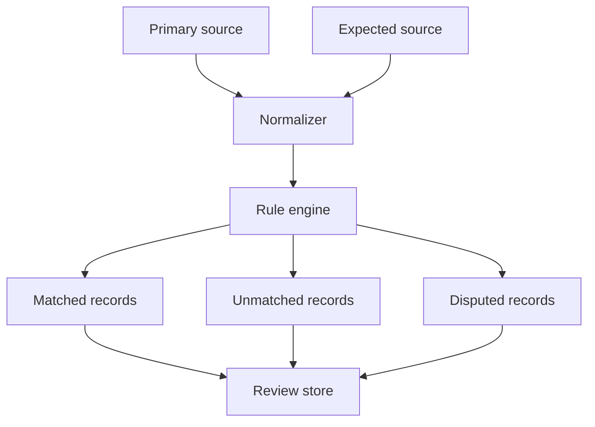

Concile is organized around a repeatable reconciliation run. Each run ingests records, normalizes them, applies rules, and writes outcomes for review.

## Architecture overview

## Components

### Sources

Sources provide records from systems of record. A source can be a database table, exported file, API response, or ledger stream.

### Normalizer

The normalizer maps source-specific fields into the shape rules expect. This keeps matching rules independent of storage details.

### Rule engine

The rule engine applies deterministic matching criteria. It should explain why two records matched or why they did not.

### Review store

The review store keeps outcomes, decisions, and run metadata. It lets teams audit what happened after a reconciliation completes.

## Next steps

- [Reconciliation](/concile/concepts/reconciliation)
- [Ledgers](/concile/concepts/ledgers)
- [Troubleshooting](/concile/troubleshooting)
