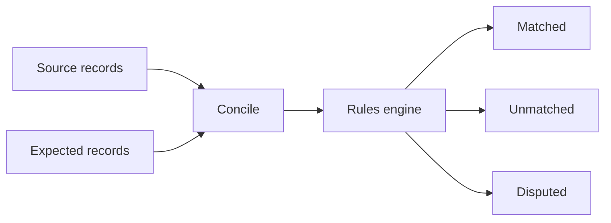

Concile compares expected state against recorded events so teams can find drift, missing records, duplicate effects, and settlement mismatches.

## What Concile does

Concile gives you a reconciliation workflow for financial and ledger-like systems. It ingests source records, applies reconciliation rules, and produces matched, unmatched, and disputed outcomes that can be reviewed.

## Why it exists

Event-driven systems often move faster than their audit trails. Concile treats reconciliation as a first-class system boundary instead of a spreadsheet exported after the fact.

The tradeoff is intentional: Concile asks you to model reconciliation rules explicitly. That takes more setup than ad hoc comparisons, but it gives you repeatable checks and explainable results.

## When to use it

- You process payments, invoices, settlements, or ledger movements.
- You need to compare records from two or more systems of record.
- You want reconciliation results that can be reviewed and re-run.
- You need to separate matching rules from application code.

## When not to use it

- You only need a one-time CSV comparison.
- Your data has no stable identifiers, timestamps, or matching attributes.
- You need a full accounting ledger instead of a reconciliation engine.

## How it works

## Project status

Experimental

The docs define the target operating model for Concile. Treat API details as provisional until the first stable package release.

## Next steps

<CardGroup cols={2}>
  <Card title="Quickstart" href="/concile/quickstart" icon="rocket">
    Run a small reconciliation from sample records.
  </Card>
  <Card title="Architecture" href="/concile/architecture" icon="layers">
    Understand the reconciliation pipeline and rule model.
  </Card>
</CardGroup>

<Snippet file="attribution.mdx" />
