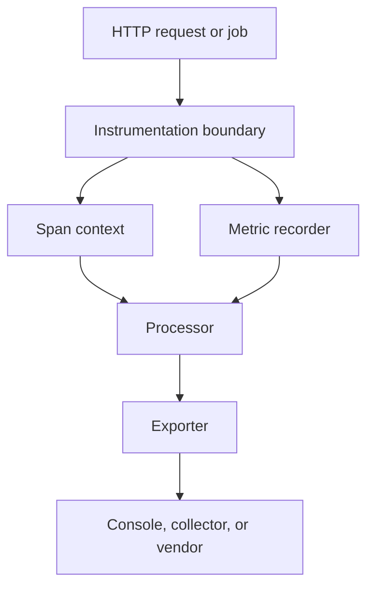

Corelens is a small in-process instrumentation layer. It should make telemetry visible without hiding how signals are created or where they go.

## Architecture overview

## Components

### Instrumentation boundary

The boundary is the code you add to your service: middleware, explicit spans, counters, and attributes. It should stay readable because it explains what the service owner considers observable.

### Span context

Span context keeps parent and child operations connected. HTTP middleware starts the request span, and explicit spans describe important work inside the request.

### Metric recorder

Metrics capture aggregate behavior such as counts, durations, and failures. Use metrics when the value should remain useful even without a sampled trace.

### Exporter

Exporters move records out of the process. The console exporter is for local verification. OTLP exporters are for collectors and production pipelines.

## Data flow

1. A request or job enters the service.
2. Corelens creates a root span at the instrumentation boundary.
3. Application code records child spans, attributes, counters, and timings.
4. The processor normalizes telemetry and applies sampling.
5. The exporter writes telemetry to the configured destination.

## Design decisions

Corelens favors explicit instrumentation over broad implicit behavior. That keeps reviews useful and prevents telemetry from becoming a hidden side effect of dependency changes.

## Next steps

- [Tracing](/corelens/concepts/tracing)
- [Metrics](/corelens/concepts/metrics)
- [Exporters](/corelens/concepts/exporters)
