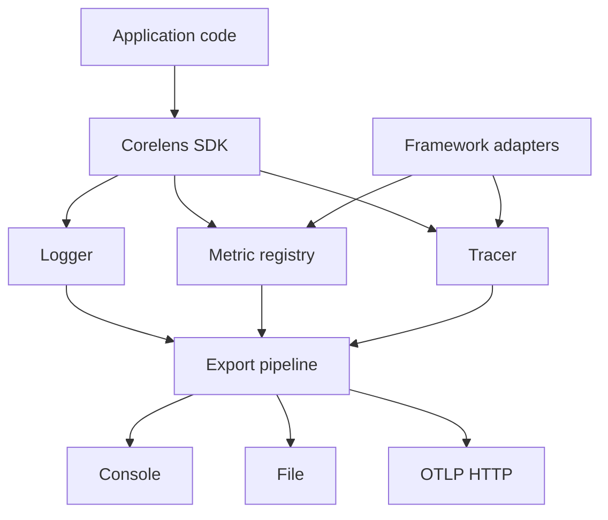

Corelens is built around explicit application instrumentation. You decide which signals are enabled, where framework adapters attach, and how telemetry leaves the process.

## Architecture overview

## Signals

Corelens records three signal types:

| Signal | Use it for |
|--------|------------|
| Logs | Discrete events with context |
| Metrics | Aggregate behavior over time |
| Traces | The path of one request, job, or operation |

These signals work best together. Logs explain what happened, metrics show how often or how long it happened, and traces show where time was spent.

## Adapters are explicit

Corelens does not globally patch your runtime. Framework adapters are registered where you set up the app.

That has a tradeoff:

- You write a little more setup code.
- The instrumentation boundary is obvious in code review.
- Framework dependencies stay optional.

## Export pipeline

The export pipeline sends logs, metrics, and traces to a destination.

Corelens supports:

- console export
- file export
- OTLP HTTP export

For production OTLP export, use batch mode with bounded queues, retry, circuit breaker behavior, and graceful shutdown.

## Back pressure and failures

Telemetry should not take down the service it is observing. Corelens uses bounded queues and configurable overflow behavior so export failures do not grow memory without limit.

When queues fill, Corelens follows the configured full queue policy. Watch `lens.getStats()` during rollout to understand dropped items and exporter failures.

## Next steps

- [Framework adapters](/corelens/framework-adapters/overview)
- [Exporters](/corelens/concepts/exporters)
- [Production](/corelens/production)
