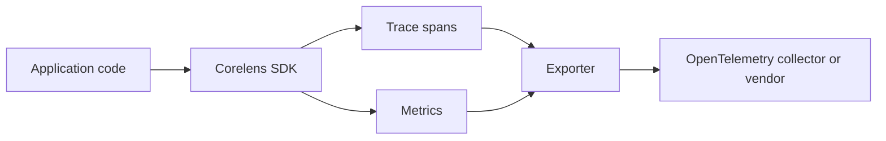

Corelens instruments Node.js services so you can see request flow, latency, errors, and runtime behavior without tying your application to one observability vendor.

## What Corelens does

Corelens gives you a small instrumentation layer for HTTP services, background jobs, and custom application operations. It captures spans and metrics close to your code, then exports them through OpenTelemetry-compatible paths.

## Why it exists

Observability libraries often become vendor glue. Corelens keeps the instrumentation boundary explicit: your application emits useful signals, exporters decide where those signals go, and the two concerns stay separate.

That tradeoff means Corelens favors clear primitives over broad automatic magic. You get predictable instrumentation and a smaller surface area, but you still need to decide which operations matter to your system.

## When to use it

- You run Node.js services and need portable tracing or metrics.
- You want instrumentation code that is easy to inspect in reviews.
- You need a bridge between application-level events and OpenTelemetry pipelines.
- You want to start with a minimal SDK before introducing a full observability platform.

## When not to use it

- You need complete auto-instrumentation for every dependency on day one.
- Your service already has a stable OpenTelemetry setup that your team understands.
- You need browser telemetry, mobile telemetry, or log indexing as a primary feature.

## How it works

Corelens sits inside the service process. It creates telemetry from request middleware, explicit spans, counters, and exporter configuration.

## Project status

Stable

The public docs treat the SDK contract as stable for application integration. Compatibility notes and migration guidance should be documented before introducing breaking changes.

## Next steps

<CardGroup cols={2}>
  <Card title="Quickstart" href="/corelens/quickstart" icon="rocket">
    Instrument a minimal Node.js service and verify local telemetry output.
  </Card>
  <Card title="Architecture" href="/corelens/architecture" icon="layers">
    Understand the instrumentation path before using Corelens in production.
  </Card>
</CardGroup>

<Snippet file="attribution.mdx" />
