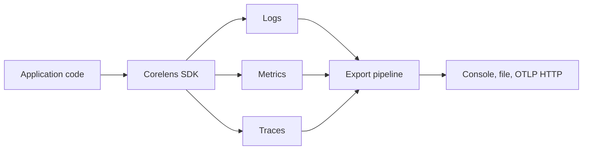

Corelens is an observability SDK for Node.js applications. It gives you structured logs, application metrics, HTTP metrics, runtime metrics, traces, and production-aware exporters without forcing you to wire every observability concern by hand on day one.

Corelens is not a full OpenTelemetry replacement. It is a smaller, opinionated SDK for common application telemetry paths. It can export to destinations that already speak OTLP, and it uses W3C trace propagation for client spans.

## What Corelens gives you

- Structured logs with optional trace correlation.
- Counters, gauges, and histograms for application metrics.
- HTTP request metrics and tracing for supported frameworks.
- Runtime metrics for Node.js process health.
- Prometheus text rendering for scrape-based metrics.
- Console, file, and OTLP HTTP export.
- Bounded queues for production export paths.
- Retry and circuit breaker behavior for network exporters.
- Graceful shutdown so batched telemetry can flush.
- Debug stats for dropped items, exporter failures, queue state, and shutdown results.

## When to use Corelens

Use Corelens when you want useful service telemetry quickly, but still want the instrumentation to stay readable.

It fits well when:

- you run Node.js APIs, workers, or gateways
- you want logs, metrics, and traces from one package
- you need OTLP export without building a full OpenTelemetry setup
- you want explicit framework adapters instead of global auto-instrumentation
- you need bounded queues, retry, circuit breakers, and shutdown behavior

## When to use OpenTelemetry directly

Use OpenTelemetry directly if you need broad auto-instrumentation coverage, vendor-specific OpenTelemetry distributions, custom collector pipelines, or deep control over every instrumentation package.

Corelens works best as a practical application SDK. OpenTelemetry remains the larger ecosystem for telemetry formats, propagation, collectors, and vendor pipelines.

## Core mental model

Corelens has four main parts:

Your code records telemetry through the SDK. Corelens keeps metrics in a local registry, creates spans through framework adapters or manual tracing, and sends logs, metrics, and traces through the configured export path.

## Supported framework adapters

Corelens currently ships explicit adapters for:

- Express
- Fastify
- Hono
- NestJS

Adapters are optional. Install the framework only when you use its adapter.

## Stable status

Stable

The documented Corelens SDK contract is treated as stable for application integration. Breaking changes should include migration notes before release.

## Next steps

<CardGroup cols={2}>
  <Card title="Quickstart" href="/corelens/quickstart" icon="rocket">
    Install Corelens and record logs, metrics, and traces in a small service.
  </Card>
  <Card title="Framework adapters" href="/corelens/framework-adapters/overview" icon="plug">
    Add HTTP metrics and tracing to Express, Fastify, Hono, or NestJS.
  </Card>
</CardGroup>

<Snippet file="attribution.mdx" />
